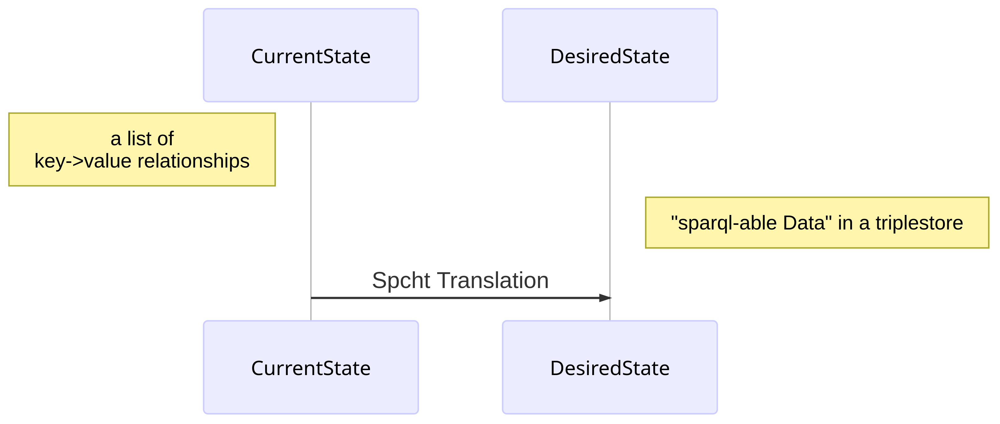

# Spcht - Solr to Triplestore Bridge

This project started out under a vastly different name. In its first life it was a very tightly built small tool aiming to provide a singular job. That objective remained mostly the same but the scope grew a bit larger and so a decision was made: a tool evolved from the first one, took its place and now provides the ability to do more than a simple tool.

There had been already processed data from various sources in a search index, in this case an Apache Solr. On of the export formats of Solr is JSON,  which includes header information and an object describing various attributes of media. This data should be transferred in a [triplestore](https://en.wikipedia.org/wiki/Triplestore), originally [OpenLink Virtuoso](https://virtuoso.openlinksw.com/) stored as RDF triples. For those triples another step has to be taken: each data-pair needs to be matched into the right kind of object. The first instance of this work was hard coded and found the mapping directly in the code. To preserve the ability to change things at a later point of time a new format was developed: the **spcht descriptor format** (*sdf*).

While other frameworks like [MetaFacture](https://github.com/metafacture) exists, these proved to be unwieldy. The format of the *spcht.json* is written in JSON and structured more simply. It cannot provide the same feature richness MetaFacture offers but runs easier. There is also a GUI tool based on QT5 inside the package to provide guidance for the format itself.

## Usage

Install via `pip install .`

Access inbuild scripts via:

* `python3 -m Spcht.main` - main cli tool, see below for details
* `python3 -m Spcht.SpchtCheckerGui` - GUI Tool
* `python3 -m Spcht.folio2triplestore.py` - foliotools, will use config file from current working directory

## Content

This work is setup as a python package and can be installed after checkout of the git repository via `pip install .`

There are four modules and three executable scripts:

| Module     | Description                                                  |
| ---------- | ------------------------------------------------------------ |
| Core       | containts the 'spcht' logic , the 'work order' functionality and other integral parts of the spcht logic |
| foliotools | holds the functionality needed to interface with the FOLIO Okapi for data retrieval |
| Gui        | Part of the graphical Interface, folder also has some assets linked to the guy and the 'SpchtBuilder' module, a different way to express spcht.json structures in a more editable way |
| Utils      | Constant Values of Spcht and a set of smaller procedures and helper functions to smooth various processes |

| Script                 | Purpose                                                      |
| ---------------------- | ------------------------------------------------------------ |
| `main.py`              | cli application, utilised work order and config files to do the main purpose of Spcht: processing data from a source to RDF data according to a scheme |
| `SpcherCheckerGui.py`  | entry point for the graphical user interface, combines functionality to create an entire spcht.json from scratch and the ability to check if a specific file is correct, also allows to demo processing |
| `folio2triplestore.py` | simple cli application for the single purpose of retrieving opening hour data of a certain structure from FOLIO to put in in a triplestore |

***Note**: use `pip install -e .`when wishing to edit in the current venv*

There are also some other files present in the repository that are of note:

| File                               | Purpose                                                      |
| ---------------------------------- | ------------------------------------------------------------ |
| `Pyinstaller_Windows_OneFile.spec` | preformed file to create a single file executable via [Pyinstaller](https://pyinstaller.readthedocs.io/en/stable/usage.html) |
| `examples/config.example.json`     | a sample config file for  the main cli application           |
| `examples/default.spcht.json`      | a sample spcht.json file to showcase some of the functionalities |
| `tests/thetestset.json`            | a small set lifted from the UBL solr, used as test data, shows data structure |
| `tests/featuretest.spcht.json`     | another spcht.json file containing abstract use cases for all spcht functions |
| `Spcht/SpchtSchema.json`           | a [json schema](https://json-schema.org/), describing the ins&outs of the spcht.json format |
| `Spcht/Gui/GuiLanguages.json`      | contains i18n/language strings for the interface, the sub-module `SpchtCheckerGui_i18n` provides some bare bones functionality to convert the json to a csv and back to ease editing |

Some in-depth explanations are available:

* [fine details of Spcht](./README/SpchtDescriptorDetails.md)
* [Foliotools](./README/Foliotools.md)
* [SpchtBuilder / fundaments of the GUI](./README/SpchtBuilder.md)

## Development Notes

Apart from very German capitalisation of random words I would also like to lose a word about the programs and plug-ins I used for this. While the master can work with everything I would not consider myself as such.

I used [Intellij PyCharm](https://www.jetbrains.com/pycharm/)  with the following plug-ins:

* Rainbow Brackets - makes it easier to find the right entry point
* GitToolBox - for people that just forget most of the functionality git offers
* Comments Highlighter - Port of the Vs Code Plug-in _Better Comments_, makes comments a bit more colorful
* CodeGlance - provides a neat minimap for the code
* a bunch of standard plug-ins that come with PyCharm when you just install it

For writing markdown files I used [Typora](https://typora.io/).

## Funding

Funded by European Regional Development Fund (EFRE)

