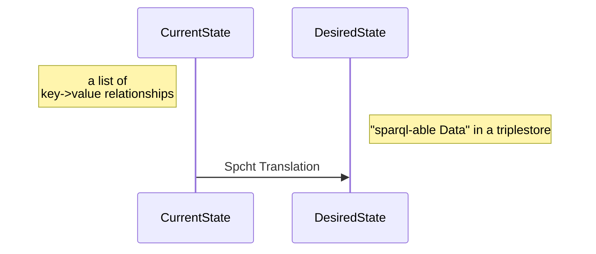

```mermaid
sequenceDiagram
	participant CurrentState
	participant DesiredState
	Note left of CurrentState: a list of <br>key->value relationships
	Note right of DesiredState: "sparql-able Data" in a triplestore
	CurrentState->>DesiredState: Spcht Translation
```

