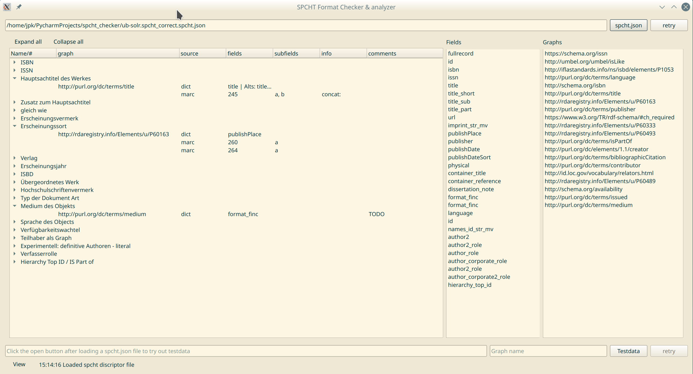
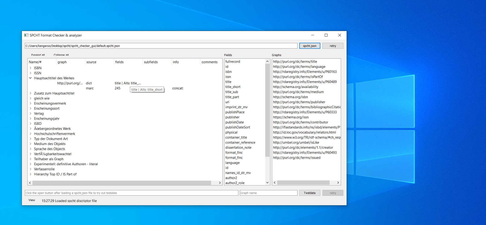

# Graphical User Interface for the SDF

A graphical interface to look at the content of a **spcht descriptor file**. Further it provides some basic functionality to test and verify the workings of a created sdf.

**Allows no editing at the moment**

The Interface is build with QT5/PySide2 and runs under Windows/Linux/Mac. I provide simple executables for Windows and Linux. Those are *compiled* with PyInstaller and might have some performance loss, startup for the single files might also be slowed down due the packed nature of the executables.

Also works under windows.

## Installation

1. Satisfy all python requirements from *requirements_gui.txt* `python3 -m pip install -r requirements.txt`
2. Generate resource file `pyside2-rcc resources.qrc -o resources.py`
3. Run spcht_checker_gui.py `python3 spcht_checker_gui.py`

## Requirements

* Python >= 3.5 (earlier Versions might work but not tested)

(Spcht Requirements)

* pymarc >= 4.0.0
* rdflib >= 5.0.0

(GUI)

* PySide2 >= 5.12
* python-dateutils (technically only for one stupid display thing)

## Credits

"Woodpecker" icon by [Serhii Smirnov](https://thenounproject.com/pockerironsv) via the [Noun Projekt](https://thenounproject.com/term/woodpecker/2777216/) under [CC 3.0](https://creativecommons.org/licenses/by/3.0/us/legalcode)

